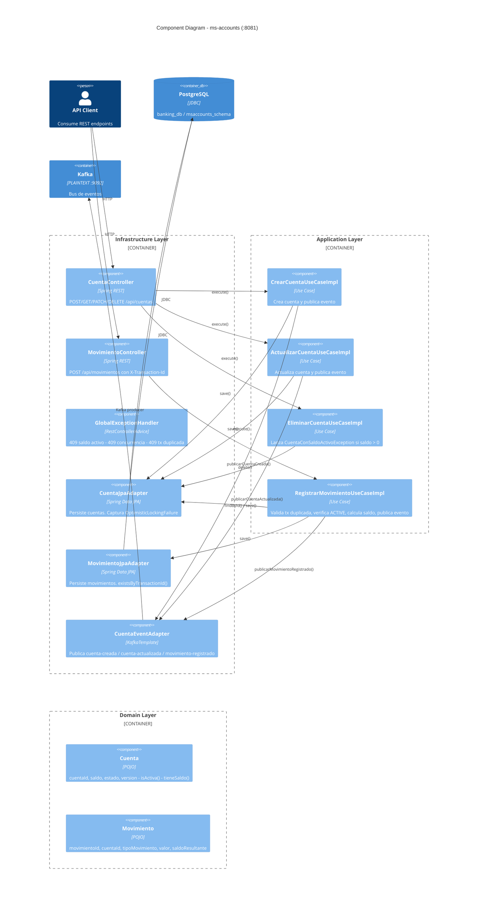

# C4 Level 3 — Component: ms-accounts

Capas internas de `ms-accounts` siguiendo arquitectura hexagonal.

```mermaid
C4Component
  title Component Diagram - ms-accounts (:8081)

  Person(usuario, "API Client", "Consume REST endpoints")
  ContainerDb(postgres, "PostgreSQL", "JDBC", "banking_db / msaccounts_schema")
  Container(kafka, "Kafka", "PLAINTEXT :9092", "Bus de eventos")

  Container_Boundary(infraLayer, "Infrastructure Layer") {
    Component(cuentaCtrl, "CuentaController", "Spring REST", "POST/GET/PATCH/DELETE /api/cuentas")
    Component(movCtrl, "MovimientoController", "Spring REST", "POST /api/movimientos con X-Transaction-Id")
    Component(exHandler, "GlobalExceptionHandler", "RestControllerAdvice", "409 saldo activo - 409 concurrencia - 409 tx duplicada")
    Component(cuentaJpa, "CuentaJpaAdapter", "Spring Data JPA", "Persiste cuentas. Captura OptimisticLockingFailure")
    Component(movJpa, "MovimientoJpaAdapter", "Spring Data JPA", "Persiste movimientos. existsByTransactionId()")
    Component(eventAdapter, "CuentaEventAdapter", "KafkaTemplate", "Publica cuenta-creada / cuenta-actualizada / movimiento-registrado")
  }

  Container_Boundary(appLayer, "Application Layer") {
    Component(crearCuenta, "CrearCuentaUseCaseImpl", "Use Case", "Crea cuenta y publica evento")
    Component(actualizarCuenta, "ActualizarCuentaUseCaseImpl", "Use Case", "Actualiza cuenta y publica evento")
    Component(eliminarCuenta, "EliminarCuentaUseCaseImpl", "Use Case", "Lanza CuentaConSaldoActivoException si saldo > 0")
    Component(registrarMov, "RegistrarMovimientoUseCaseImpl", "Use Case", "Valida tx duplicada, verifica ACTIVE, calcula saldo, publica evento")
  }

  Container_Boundary(domainLayer, "Domain Layer") {
    Component(cuentaModel, "Cuenta", "POJO", "cuentaId, saldo, estado, version - isActiva() - tieneSaldo()")
    Component(movModel, "Movimiento", "POJO", "movimientoId, cuentaId, tipoMovimiento, valor, saldoResultante")
  }

  Rel(usuario, cuentaCtrl, "HTTP")
  Rel(usuario, movCtrl, "HTTP")
  Rel(cuentaCtrl, crearCuenta, "execute()")
  Rel(cuentaCtrl, actualizarCuenta, "execute()")
  Rel(cuentaCtrl, eliminarCuenta, "execute()")
  Rel(movCtrl, registrarMov, "execute()")
  Rel(registrarMov, cuentaJpa, "findById() / save()")
  Rel(registrarMov, movJpa, "save()")
  Rel(registrarMov, eventAdapter, "publicarMovimientoRegistrado()")
  Rel(crearCuenta, cuentaJpa, "save()")
  Rel(crearCuenta, eventAdapter, "publicarCuentaCreada()")
  Rel(actualizarCuenta, cuentaJpa, "save()")
  Rel(actualizarCuenta, eventAdapter, "publicarCuentaActualizada()")
  Rel(eliminarCuenta, cuentaJpa, "delete()")
  Rel(cuentaJpa, postgres, "JDBC")
  Rel(movJpa, postgres, "JDBC")
  Rel(eventAdapter, kafka, "Kafka producer")
```
