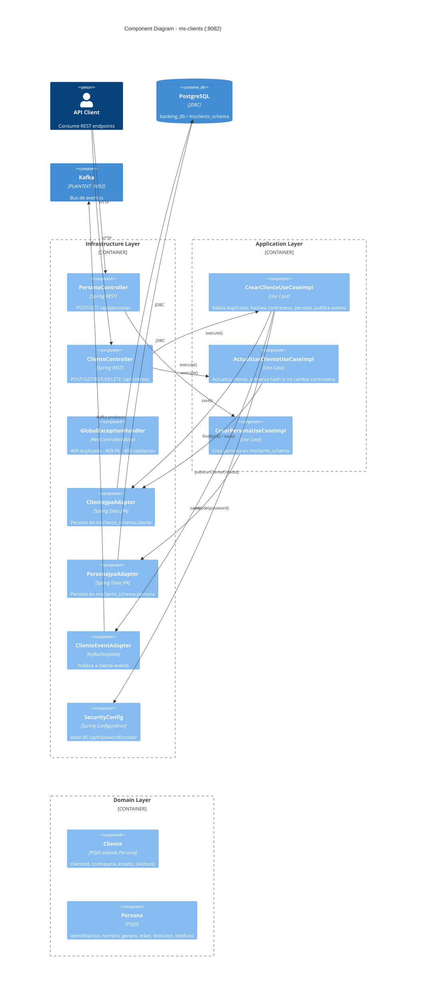

# C4 Level 3 — Component: ms-clients

Capas internas de `ms-clients` siguiendo arquitectura hexagonal.

```mermaid
C4Component
  title Component Diagram - ms-clients (:8082)

  Person(usuario, "API Client", "Consume REST endpoints")
  ContainerDb(postgres, "PostgreSQL", "JDBC", "banking_db / msclients_schema")
  Container(kafka, "Kafka", "PLAINTEXT :9092", "Bus de eventos")

  Container_Boundary(infraLayer, "Infrastructure Layer") {
    Component(personaCtrl, "PersonaController", "Spring REST", "POST/GET /api/personas")
    Component(clienteCtrl, "ClienteController", "Spring REST", "POST/GET/PUT/DELETE /api/clientes")
    Component(exHandler, "GlobalExceptionHandler", "RestControllerAdvice", "409 duplicado - 409 FK - 400 validacion")
    Component(clienteJpa, "ClienteJpaAdapter", "Spring Data JPA", "Persiste en msclients_schema.cliente")
    Component(personaJpa, "PersonaJpaAdapter", "Spring Data JPA", "Persiste en msclients_schema.persona")
    Component(kafkaAdapter, "ClienteEventAdapter", "KafkaTemplate", "Publica a cliente-events")
    Component(secConfig, "SecurityConfig", "Spring Configuration", "Bean BCryptPasswordEncoder")
  }

  Container_Boundary(appLayer, "Application Layer") {
    Component(crearCliente, "CrearClienteUseCaseImpl", "Use Case", "Valida duplicado, hashea contrasena, persiste, publica evento")
    Component(actualizarCliente, "ActualizarClienteUseCaseImpl", "Use Case", "Actualiza cliente, preserva hash si no cambia contrasena")
    Component(crearPersona, "CrearPersonaUseCaseImpl", "Use Case", "Crea persona en msclients_schema")
  }

  Container_Boundary(domainLayer, "Domain Layer") {
    Component(clienteModel, "Cliente", "POJO extends Persona", "clienteId, contrasena, estado, isActivo()")
    Component(personaModel, "Persona", "POJO", "identificacion, nombre, genero, edad, direccion, telefono")
  }

  Rel(usuario, personaCtrl, "HTTP")
  Rel(usuario, clienteCtrl, "HTTP")
  Rel(clienteCtrl, crearCliente, "execute()")
  Rel(clienteCtrl, actualizarCliente, "execute()")
  Rel(personaCtrl, crearPersona, "execute()")
  Rel(crearCliente, clienteJpa, "save()")
  Rel(crearCliente, kafkaAdapter, "publicarClienteCreado()")
  Rel(crearCliente, secConfig, "encode(password)")
  Rel(actualizarCliente, clienteJpa, "findById() / save()")
  Rel(crearPersona, personaJpa, "save()")
  Rel(clienteJpa, postgres, "JDBC")
  Rel(personaJpa, postgres, "JDBC")
  Rel(kafkaAdapter, kafka, "Kafka producer")
```
