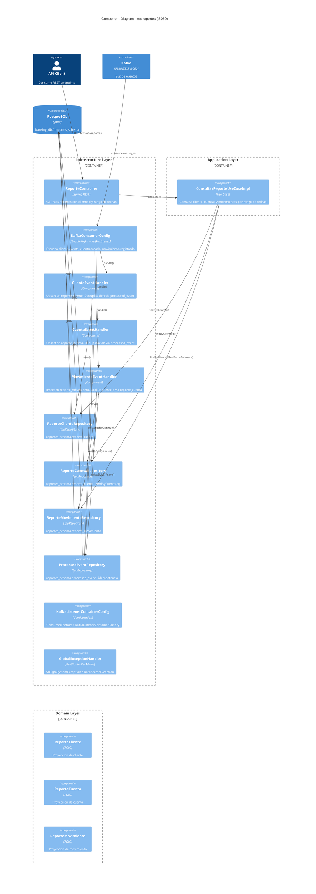

# C4 Level 3 — Component: ms-reportes

Capas internas de `ms-reportes` (CQRS read model).

```mermaid
C4Component
  title Component Diagram - ms-reportes (:8080)

  Person(usuario, "API Client", "Consume REST endpoints")
  Container(kafka, "Kafka", "PLAINTEXT :9092", "Bus de eventos")
  ContainerDb(postgres, "PostgreSQL", "JDBC", "banking_db / reportes_schema")

  Container_Boundary(infraLayer, "Infrastructure Layer") {
    Component(reporteCtrl, "ReporteController", "Spring REST", "GET /api/reportes con clienteId y rango de fechas")
    Component(kafkaConsumer, "KafkaConsumerConfig", "EnableKafka + KafkaListener", "Escucha cliente-events, cuenta-creada, movimiento-registrado")
    Component(clienteHandler, "ClienteEventHandler", "Component", "Upsert en reporte_cliente. Deduplicacion via processed_event")
    Component(cuentaHandler, "CuentaEventHandler", "Component", "Upsert en reporte_cuenta. Deduplicacion via processed_event")
    Component(movHandler, "MovimientoEventHandler", "Component", "Insert en reporte_movimiento. Lookup clienteId via reporte_cuenta")
    Component(clienteRepo, "ReporteClienteRepository", "JpaRepository", "reportes_schema.reporte_cliente")
    Component(cuentaRepo, "ReporteCuentaRepository", "JpaRepository", "reportes_schema.reporte_cuenta - findByCuentaId()")
    Component(movRepo, "ReporteMovimientoRepository", "JpaRepository", "reportes_schema.reporte_movimiento")
    Component(processedRepo, "ProcessedEventRepository", "JpaRepository", "reportes_schema.processed_event - idempotencia")
    Component(kafkaConfig, "KafkaListenerContainerConfig", "Configuration", "ConsumerFactory + KafkaListenerContainerFactory")
    Component(exHandler, "GlobalExceptionHandler", "RestControllerAdvice", "503 JpaSystemException / DataAccessException")
  }

  Container_Boundary(appLayer, "Application Layer") {
    Component(consultarUseCase, "ConsultarReporteUseCaseImpl", "Use Case", "Consulta cliente, cuentas y movimientos por rango de fechas")
  }

  Container_Boundary(domainLayer, "Domain Layer") {
    Component(reporteCliente, "ReporteCliente", "POJO", "Proyeccion de cliente")
    Component(reporteCuenta, "ReporteCuenta", "POJO", "Proyeccion de cuenta")
    Component(reporteMovimiento, "ReporteMovimiento", "POJO", "Proyeccion de movimiento")
  }

  Rel(usuario, reporteCtrl, "HTTP GET /api/reportes")
  Rel(reporteCtrl, consultarUseCase, "consultar()")
  Rel(consultarUseCase, clienteRepo, "findByClienteId()")
  Rel(consultarUseCase, cuentaRepo, "findByClienteId()")
  Rel(consultarUseCase, movRepo, "findByClienteIdAndFechaBetween()")

  Rel(kafka, kafkaConsumer, "consume messages")
  Rel(kafkaConsumer, clienteHandler, "handle()")
  Rel(kafkaConsumer, cuentaHandler, "handle()")
  Rel(kafkaConsumer, movHandler, "handle()")

  Rel(clienteHandler, processedRepo, "existsById() / save()")
  Rel(clienteHandler, clienteRepo, "save()")
  Rel(cuentaHandler, processedRepo, "existsById() / save()")
  Rel(cuentaHandler, cuentaRepo, "save()")
  Rel(movHandler, processedRepo, "existsById() / save()")
  Rel(movHandler, movRepo, "save()")
  Rel(movHandler, cuentaRepo, "findByCuentaId()")

  Rel(clienteRepo, postgres, "JDBC")
  Rel(cuentaRepo, postgres, "JDBC")
  Rel(movRepo, postgres, "JDBC")
  Rel(processedRepo, postgres, "JDBC")
```
