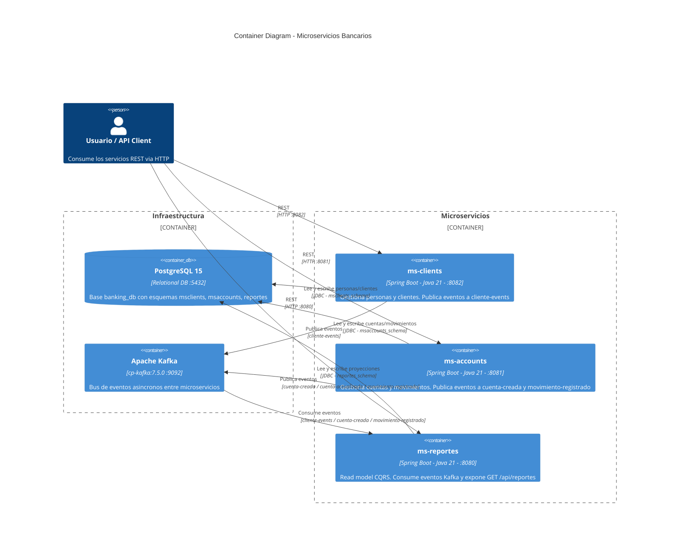

# C4 Level 2 — Container

Infraestructura y microservicios con sus tecnologías y puertos reales.

```mermaid
C4Container
  title Container Diagram - Microservicios Bancarios

  Person(usuario, "Usuario / API Client", "Consume los servicios REST via HTTP")

  Container_Boundary(infra, "Infraestructura") {
    ContainerDb(postgres, "PostgreSQL 15", "Relational DB :5432", "Base banking_db con esquemas msclients, msaccounts, reportes")
    Container(kafka, "Apache Kafka", "cp-kafka:7.5.0 :9092", "Bus de eventos asincronos entre microservicios")
  }

  Container_Boundary(apps, "Microservicios") {
    Container(msClients, "ms-clients", "Spring Boot - Java 21 - :8082", "Gestiona personas y clientes. Publica eventos a cliente-events")
    Container(msAccounts, "ms-accounts", "Spring Boot - Java 21 - :8081", "Gestiona cuentas y movimientos. Publica eventos a cuenta-creada y movimiento-registrado")
    Container(msReportes, "ms-reportes", "Spring Boot - Java 21 - :8080", "Read model CQRS. Consume eventos Kafka y expone GET /api/reportes")
  }

  Rel(usuario, msClients, "REST", "HTTP :8082")
  Rel(usuario, msAccounts, "REST", "HTTP :8081")
  Rel(usuario, msReportes, "REST", "HTTP :8080")

  Rel(msClients, postgres, "Lee y escribe personas/clientes", "JDBC - msclients_schema")
  Rel(msAccounts, postgres, "Lee y escribe cuentas/movimientos", "JDBC - msaccounts_schema")
  Rel(msReportes, postgres, "Lee y escribe proyecciones", "JDBC - reportes_schema")

  Rel(msClients, kafka, "Publica eventos", "cliente-events")
  Rel(msAccounts, kafka, "Publica eventos", "cuenta-creada / cuenta-actualizada / movimiento-registrado")
  Rel(kafka, msReportes, "Consume eventos", "cliente-events / cuenta-creada / movimiento-registrado")
```
