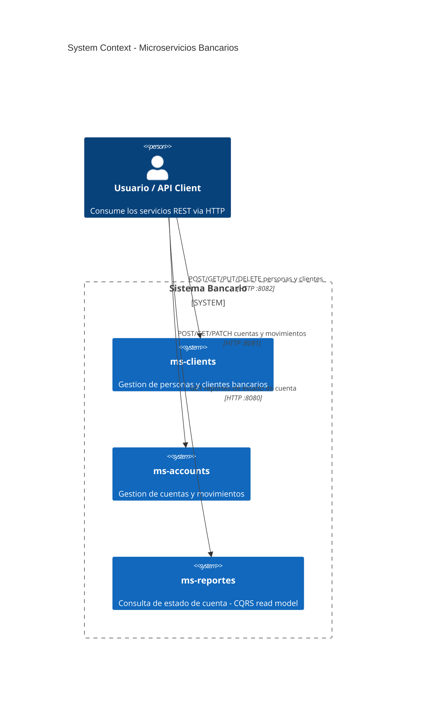

# C4 Level 1 — Context

Vista de alto nivel: actores externos y el sistema bancario.

```mermaid
C4Context
  title System Context - Microservicios Bancarios

  Person(usuario, "Usuario / API Client", "Consume los servicios REST via HTTP")

  System_Boundary(sistema, "Sistema Bancario") {
    System(msClients,  "ms-clients",  "Gestion de personas y clientes bancarios")
    System(msAccounts, "ms-accounts", "Gestion de cuentas y movimientos")
    System(msReportes, "ms-reportes", "Consulta de estado de cuenta - CQRS read model")
  }

  Rel(usuario, msClients,  "POST/GET/PUT/DELETE personas y clientes", "HTTP :8082")
  Rel(usuario, msAccounts, "POST/GET/PATCH cuentas y movimientos", "HTTP :8081")
  Rel(usuario, msReportes, "GET reportes de estado de cuenta", "HTTP :8080")
```
