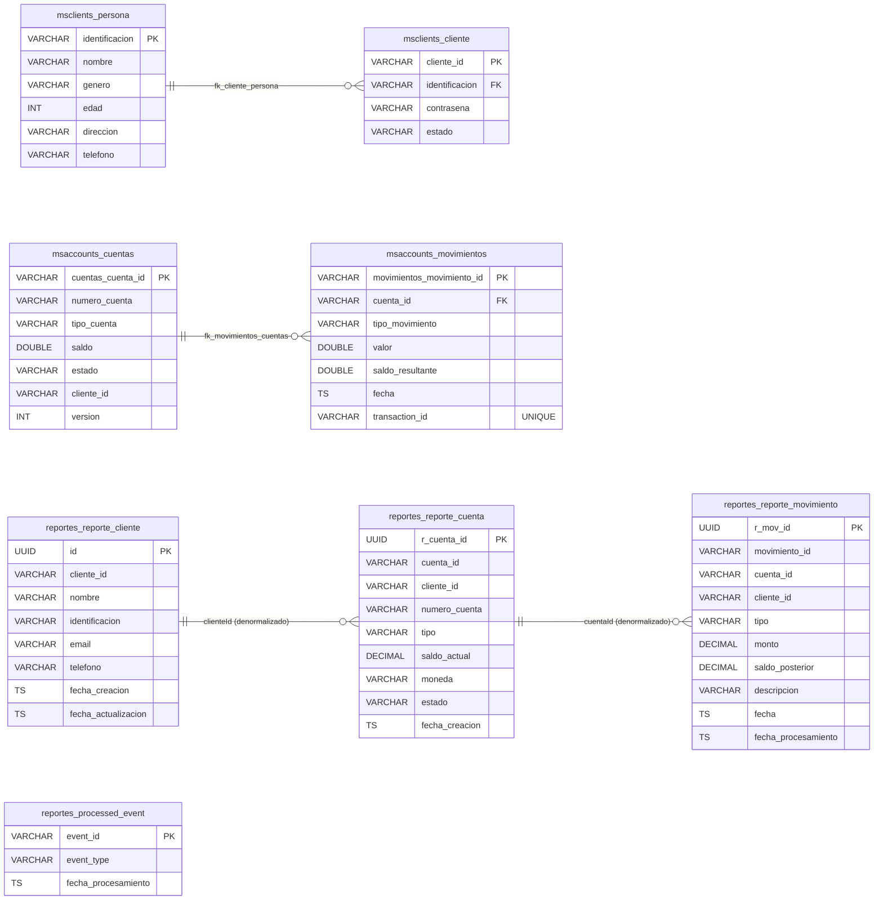

# Esquema de Base de Datos — banking_db

Base de datos única `banking_db` en PostgreSQL 15, con tres esquemas separados por microservicio.

## Notas

- `msclients_schema` y `msaccounts_schema` son los modelos de escritura.
- `reportes_schema` es el modelo de lectura (CQRS), actualizado exclusivamente por eventos Kafka.
- `processed_event` garantiza idempotencia: un evento con el mismo `event_id` no se procesa dos veces.
- Todos los `cliente_id`, `cuenta_id`, `movimiento_id` en `reportes_schema` son `VARCHAR(50)` para admitir IDs arbitrarios (ej: `cli-001`, `acc-001`).
