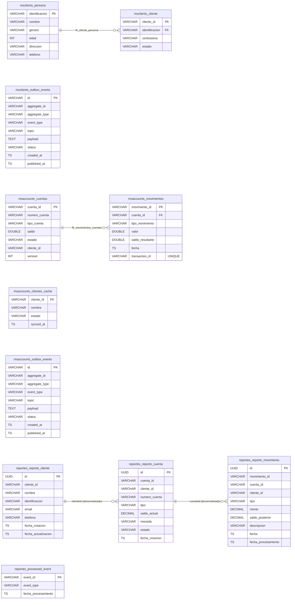

# Esquema de Base de Datos — banking_db

Base de datos única `banking_db` en PostgreSQL 15, con tres esquemas separados por microservicio.

## Notas

### Modelos de escritura
- `msclients_schema` y `msaccounts_schema` son los modelos de escritura (negocio).
- Cada uno tiene su tabla `outbox_events` para el Transactional Outbox Pattern.

### Outbox Pattern (`outbox_events`)
- `status`: `PENDING` (recien creado, aun no publicado a Kafka) o `PUBLISHED` (ya enviado y confirmado).
- `topic`: nombre del topic Kafka destino (ej: `cliente-events`, `cuenta-creada`).
- `payload`: JSON serializado de la entidad de dominio.
- `published_at`: timestamp cuando el `OutboxRelayService` lo publicó exitosamente.
- Indice sobre `status` para que el relay consulte eficientemente solo los `PENDING`.

### Read Model local (`clientes_cache` en `msaccounts_schema`)
- Proyeccion local en `ms-accounts` de los clientes existentes en `ms-clients`.
- Actualizada por el `ClienteEventConsumer` al recibir eventos del topic `cliente-events`.
- Usada por `CrearCuentaUseCaseImpl` para validar existencia del cliente sin llamadas HTTP.
- `synced_at`: ultima vez que el evento fue procesado (permite detectar eventos desactualizados).

### Read Model CQRS (`reportes_schema`)
- Modelo de lectura exclusivo de `ms-reportes`, actualizado solo por eventos Kafka.
- `processed_event` garantiza idempotencia: un `event_id` no se procesa dos veces.
- Todos los `cliente_id`, `cuenta_id`, `movimiento_id` son `VARCHAR(50)` para admitir IDs arbitrarios (ej: `cli-001`, `acc-001`).
