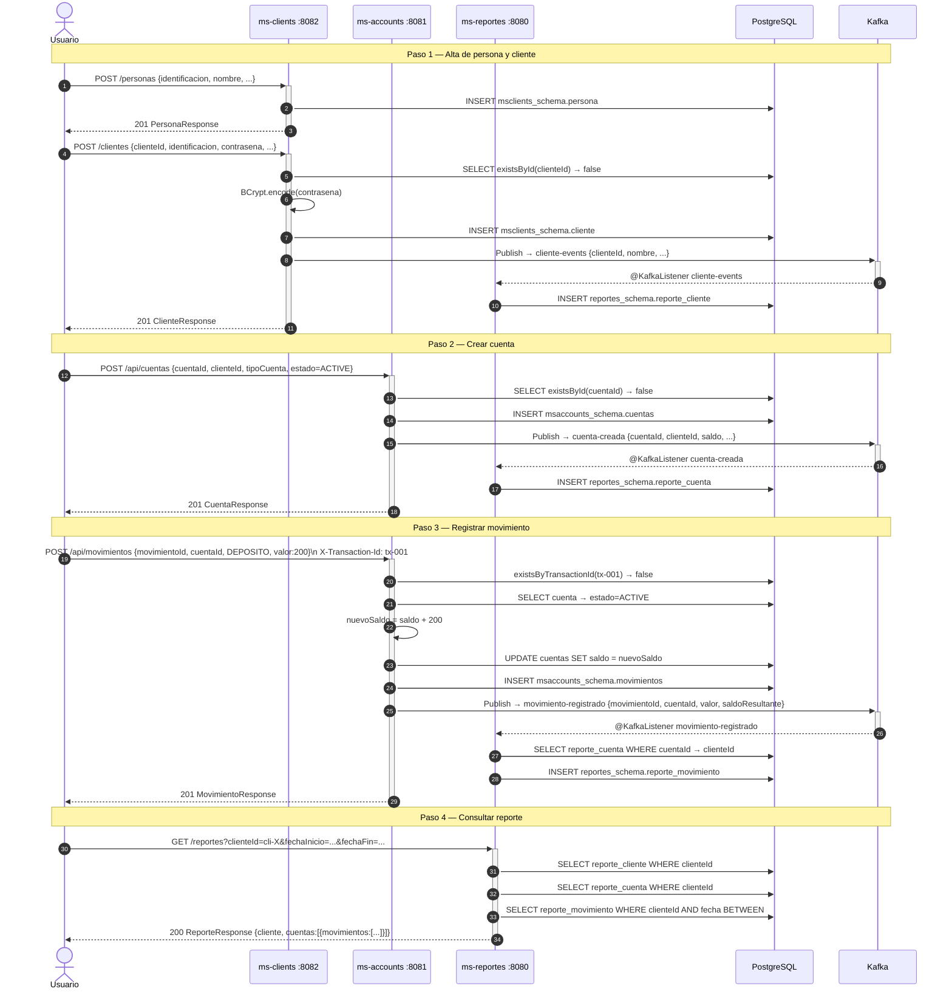
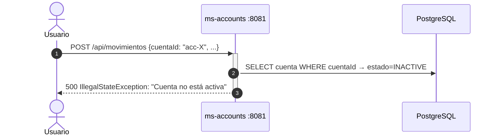
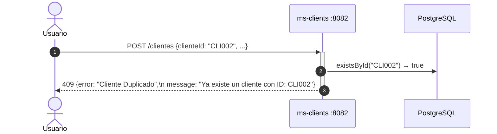
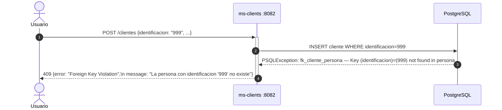

# Sequence Diagrams — Flujos principales

## Flujo completo: crear cliente → crear cuenta → registrar movimiento → consultar reporte

---

## Flujo de error: transacción duplicada

---

## Flujo de error: cuenta no activa

---

## Flujo de error: cliente duplicado

---

## Flujo de error: FK persona inexistente

