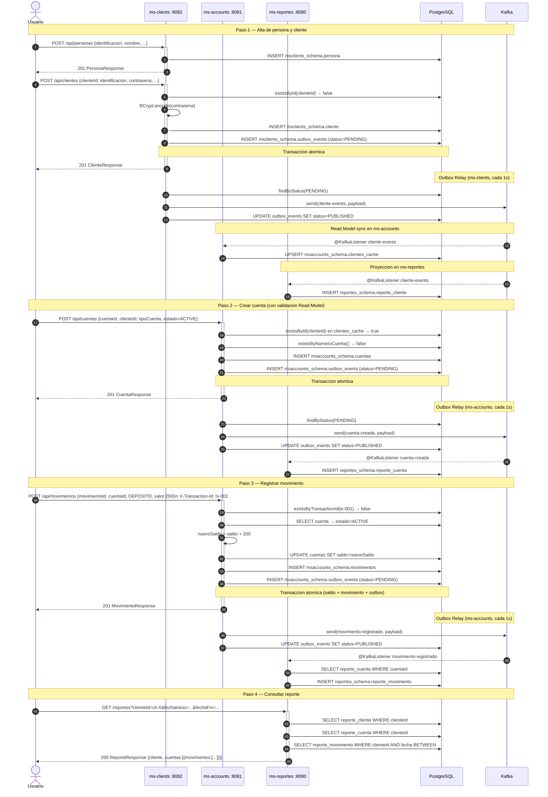
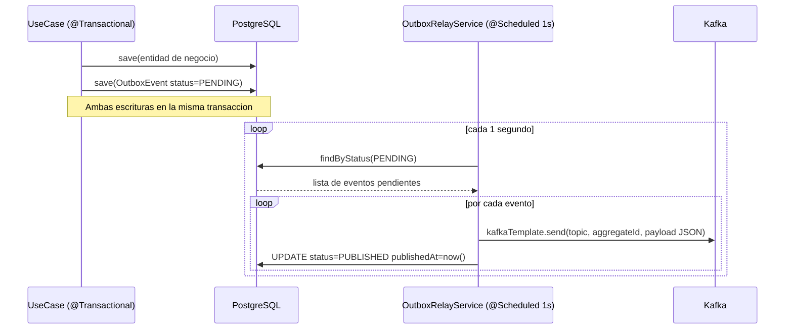
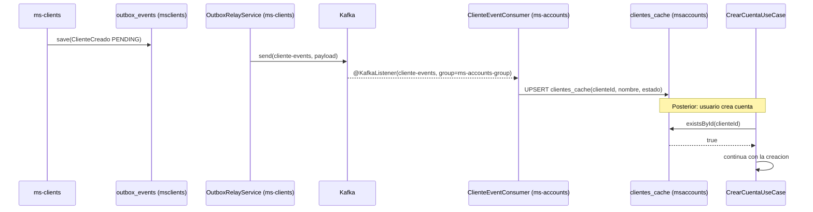
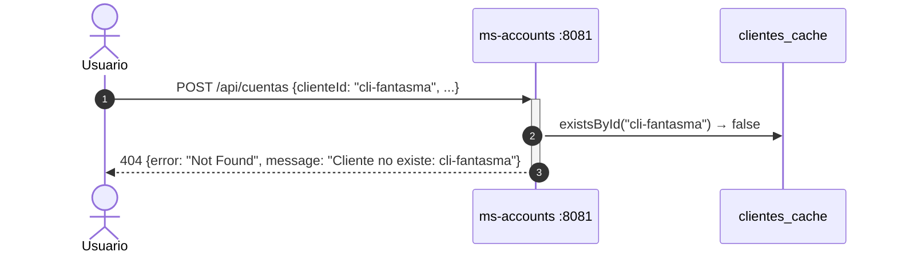
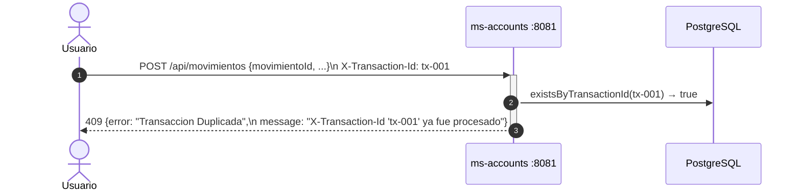
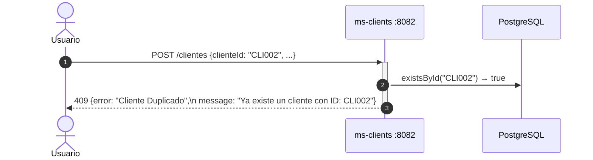
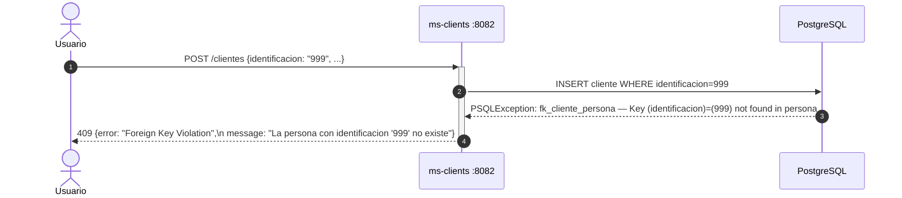

# Sequence Diagrams — Flujos principales

## Flujo completo con Outbox Pattern y Read Model

---

## Flujo Outbox Pattern — detalle

---

## Flujo Read Model — sincronizacion clientes_cache

---

## Flujo de error: cuenta con cliente inexistente (Read Model)

---

## Flujo de error: transaccion duplicada

---

## Flujo de error: cuenta no activa

---

## Flujo de error: cliente duplicado

---

## Flujo de error: FK persona inexistente

